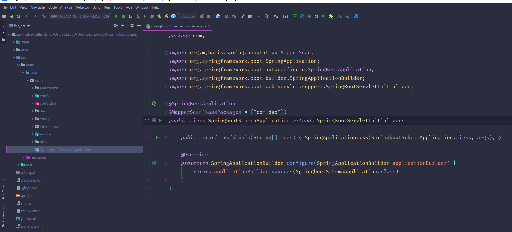
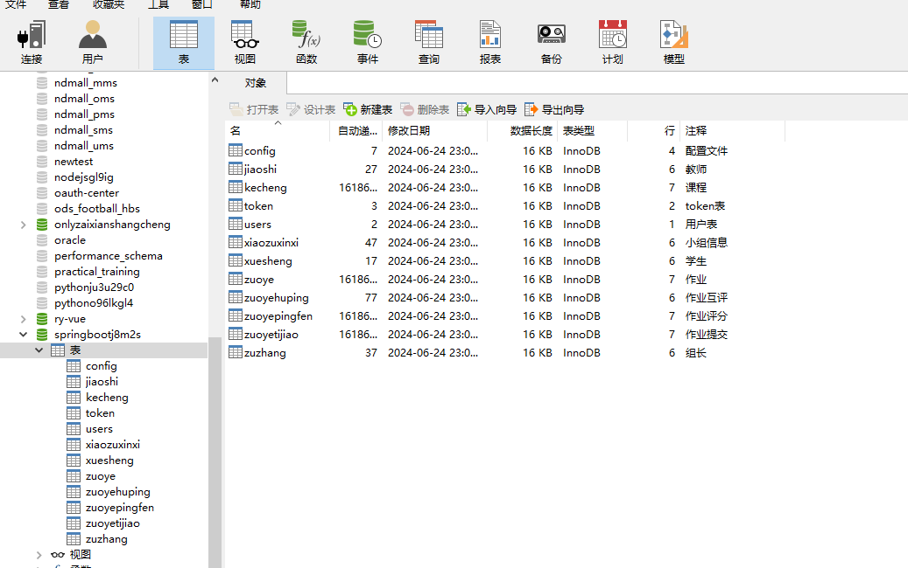
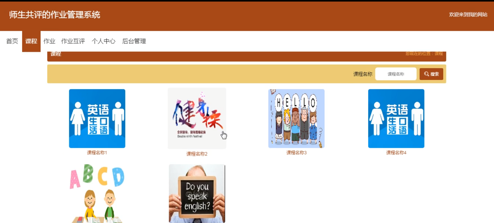
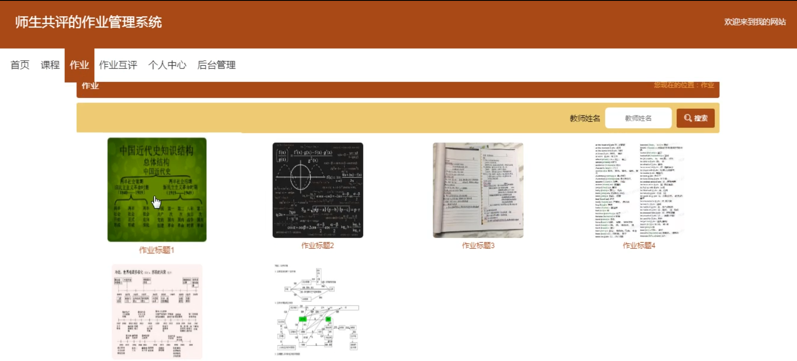
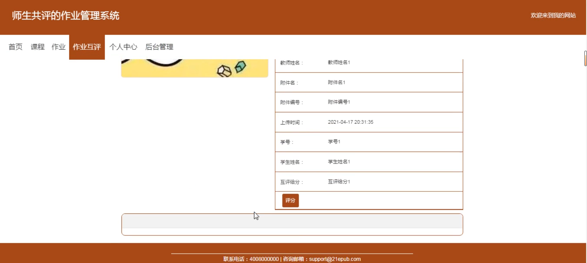
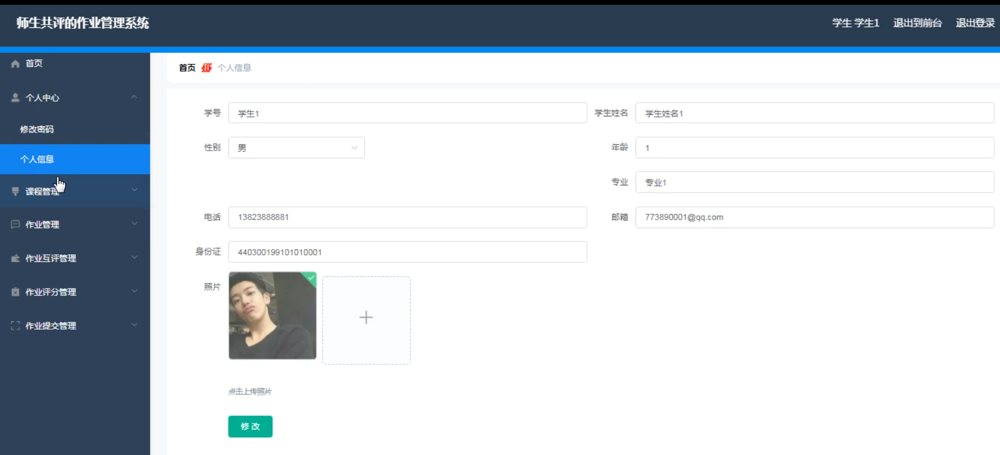
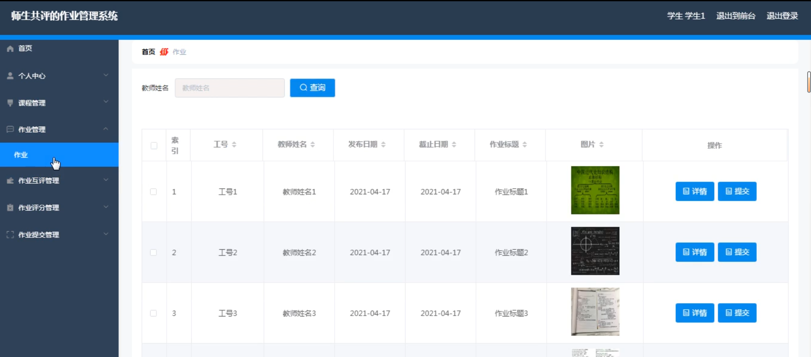
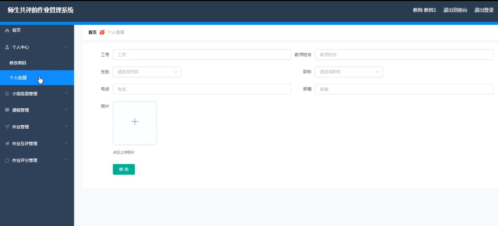
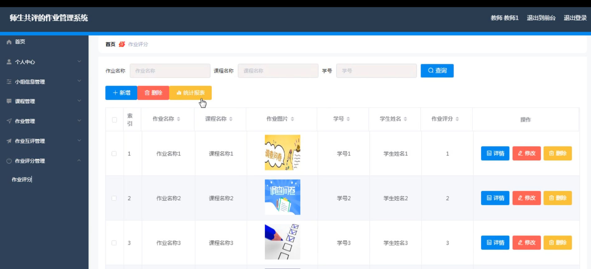

# 基于springboot的师生共评的作业管理系统

#### 介绍

基于Spring Boot的师生共评作业管理系统是一个旨在提高作业管理效率、促进师生互动与沟通的教育信息化平台。该系统采用现代化的Web开发技术，结合Spring Boot框架的轻量级、快速开发特性，为教师和学生提供了一个便捷、高效、安全的作业管理环境。系统支持教师发布作业、管理课程、进行作业评分与互评，同时也支持学生完成作业、参与互评、查看成绩等操作，从而实现了师生之间的紧密协作和高效反馈。

#### 技术栈

后端技术栈：Springboot+Mysql+Maven

前端技术栈：Vue+Html+Css+Javascript+ElementUI

开发工具：Idea+Vscode+Navicate

#### 系统功能介绍

教师模块  
课程管理：教师可以创建、编辑、删除课程信息，包括课程名称、课程描述、上课时间等。  
作业管理：教师可以发布作业，设置作业要求、截止日期等，并能随时查看作业提交情况。  
作业互评管理：教师能启动作业互评功能，设定互评规则，并监控互评进度。  
作业评分管理：教师可以对作业进行评分，支持手动评分和自动评分两种方式。  
作业提交管理：教师能查看学生作业提交情况，对未按时提交的学生进行提醒。  
个人中心：教师能查看个人信息、修改密码、管理个人账号等。  

学生模块  
课程管理：学生可以查看课程列表、选择参与课程，了解课程相关信息。  
作业管理：学生能在系统中查看作业要求，提交作业，并随时查看作业状态。  
作业互评管理：学生可参与作业互评，根据教师设定的规则对其他同学的作业进行评分和评论。  
小组信息管理：学生可以创建或加入小组，进行团队协作和小组作业的管理。  
作业评分管理：学生可以查看自己的作业评分和互评结果，了解自己的学习状况。  
个人中心：学生能查看个人信息、修改密码、管理个人账号等。  

#### 系统作用

提高作业管理效率：系统实现了作业从发布到评分的全流程自动化管理，极大地提高了教师的工作效率。  
促进师生互动与沟通：作业互评功能鼓励学生之间的相互学习和交流，同时教师也能通过系统及时了解学生的学习状况并给予反馈。  
提升学习效果：学生能通过系统随时查看作业评分和互评结果，及时了解自己的学习不足之处，进而改进学习方法。  
便捷的数据统计与分析：系统能自动收集和分析作业数据，为教师提供决策支持，帮助教师更好地调整教学策略。  

#### 系统功能截图

代码结构

数据库表

课程

作业

作业互评

学生端后台管理

作业管理

教师端个人信息

作业评分

#### 总结

基于Spring Boot的师生共评作业管理系统是一个功能全面、操作便捷的教育信息化平台。通过该系统，教师和学生能够高效地进行作业管理、互动交流和学习反馈，有效提升了教学效果和学习效果。未来，该系统将继续优化和完善功能模块，以满足更多用户的需求，为教育信息化的发展贡献更大的力量。

#### 使用说明

创建数据库，执行数据库脚本 修改jdbc数据库连接参数 下载安装maven依赖jar 启动idea中的springboot项目

后台地址：http://localhost:8080/springbootj8m2s/admin/dist/index.html

管理员  abo 密码 abo

前台地址：http://localhost:8080/springbootj8m2s/front/index.html
